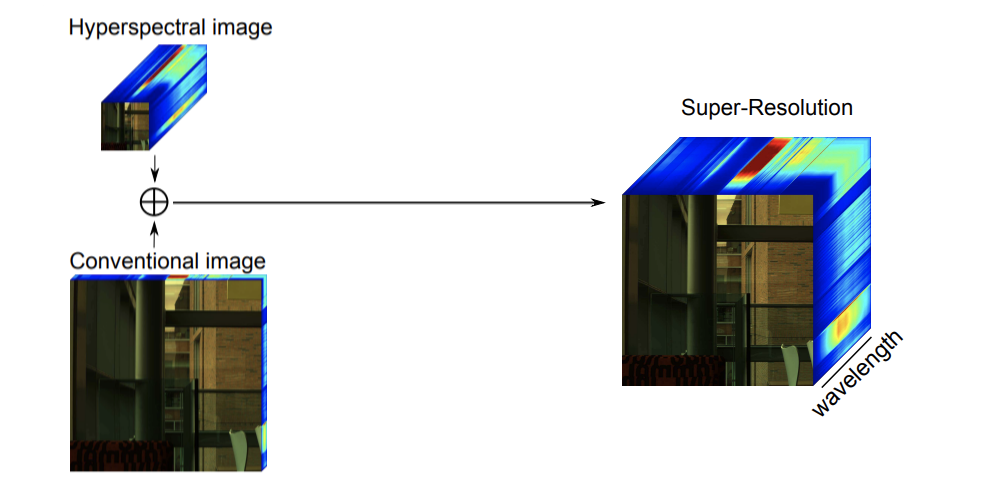

# Multispectral and Hyperspectral Image Fusion Benchmarking

**Comparison the multispectral (MS) and hyperspectral (HS) image fusion techniques used for the spatial resolution enhancement of HS images.**

Existing hyperspectral imaging systems produce images that lack spatial resolution due to hardware limitations. Even with the proven efficacy of this technology in several computer vision tasks, the aforementioned limitation obstructs its applicability. Contrarily, conventional RGB images have a much larger resolution with just three spectra. Since the issue of low resolution images arises from hardware limitations, there have been several developments in software-based approaches to improve the spatial resolution of hyperspectral images.



This work allows for an easy-to-use framework for testing and comparing existing image fusion methods of resolution enhancement for hyperspectral images. Part of the code is adapted from "Hyperspectral and Multispectral Data Fusion: A Comparative Review" [^1].

## Instructions

Download and process dataset(s) (e.g.: CAVE). This will also create MS image and downsampled HS image by a factor of 4 (or any other power of 2):

```
python aux/dataset_CAVE.py 4
```

Run all algorithms over the dataset:

```
python run.py
```

You can edit ``run.py`` to customize the combinatory that you wish to process in terms of datasets, methods and scaling factors.

## Methods

| Method | Year | Code | Paper |
| --- | --- | --- | --- |
| CNMF | 2011 | [Python](https://naotoyokoya.com/assets/zip/CNMF_Python.zip) [Matlab](https://naotoyokoya.com/assets/zip/CNMF_MATLAB.zip) | [Yokoya, N., Yairi, T., & Iwasaki, A. (2011, July). Coupled non-negative matrix factorization (CNMF) for hyperspectral and multispectral data fusion: Application to pasture classification. In 2011 IEEE International Geoscience and Remote Sensing Symposium (pp. 1779-1782). IEEE.](http://www.naotoyokoya.com/assets/pdf/NYokoyaTGRS2012.pdf) |
| FUSE | 2015 | [Matlab](http://wei.perso.enseeiht.fr/demo/MCMCFusion.7z) | [Wei, Q., Dobigeon, N., & Tourneret, J. Y. (2015). Bayesian fusion of multi-band images. IEEE Journal of Selected Topics in Signal Processing, 9(6), 1117-1127.](http://wei.perso.enseeiht.fr/papers/WEI_JSTSP_final.pdf) |
| SFIM* | 2000 | [Matlab](https://openremotesensing.net/wp-content/uploads/2017/11/HSMSFusionToolbox.zip) | [Liu, J. G. (2000). Smoothing filter-based intensity modulation: A spectral preserve image fusion technique for improving spatial details. International Journal of Remote Sensing, 21(18), 3461-3472.](https://citeseerx.ist.psu.edu/viewdoc/download?doi=10.1.1.469.2091&rep=rep1&type=pdf) |
| HySure | 2014 | [Matlab](https://github.com/alfaiate/HySure) | [Simoes, M., Bioucas-Dias, J., Almeida, L. B., & Chanussot, J. (2014, October). Hyperspectral image superresolution: An edge-preserving convex formulation. In 2014 IEEE International Conference on Image Processing (ICIP) (pp. 4166-4170). IEEE.](http://www.lx.it.pt/~bioucas/files/icip_2014_hs_sr_convex.pdf) |
| GLP* | 2006 | [Matlab](https://openremotesensing.net/wp-content/uploads/2017/11/HSMSFusionToolbox.zip) | [Aiazzi, B., Alparone, L., Baronti, S., Garzelli, A., & Selva, M. (2006). MTF-tailored multiscale fusion of high-resolution MS and Pan imagery. Photogrammetric Engineering & Remote Sensing, 72(5), 591-596.](https://www.ingentaconnect.com/contentone/asprs/pers/2006/00000072/00000005/art00007?crawler=true&mimetype=application/pdf) |
| GSA | 2007 | [Matlab](https://openremotesensing.net/wp-content/uploads/2017/11/HSMSFusionToolbox.zip) | [Aiazzi, B., Baronti, S., & Selva, M. (2007). Improving component substitution pansharpening through multivariate regression of MS +Pan data. IEEE Transactions on Geoscience and Remote Sensing, 45(10), 3230-3239.](https://d1wqtxts1xzle7.cloudfront.net/48446856/tgrs.2007.90100720160830-4045-b5r3a4-with-cover-page-v2.pdf?Expires=1650037886&Signature=d8gad3UNRLz-JrHo~fsLTSMVaaTKtKzsxHTi1GPlvO4BoVpiIIoRldM7JHyqJXozN7aEIIj-mC3wflIkODFGkULcrJhQ-v1X-pCmAAEByW5aDxftC8RB7X7kCdIHwfx~xfhfE0YkKuzaJOw2ZGFem6KUFX~DNts2CZNN524oEaAXzZeGm~TpK6eZnEPPFRamiREXzyg4~QfoAw~TFuRD8uLbQ9BSCEkpvWblDnFdsgseVseF4AJ5J4HFzK3yuBTtDgQgDwLG29yJg-ViccakE~zMau7eoDFZPs594MOrOziuUXJGumeg4MWeqidO7EXaiylVQs0u5yfa~Cwo1ZZvaw__&Key-Pair-Id=APKAJLOHF5GGSLRBV4ZA) |
| SupResPALM | 2015 | [Matlab](https://github.com/lanha/SupResPALM) | [Lanaras, C., Baltsavias, E., & Schindler, K. (2015). Hyperspectral super-resolution by coupled spectral unmixing. In Proceedings of the IEEE international conference on computer vision (pp. 3586-3594).](https://openaccess.thecvf.com/content_iccv_2015/papers/Lanaras_Hyperspectral_Super-Resolution_by_ICCV_2015_paper.pdf) |
| MAPSMM | 2004 | [Matlab](https://openremotesensing.net/wp-content/uploads/2017/11/HSMSFusionToolbox.zip) | [Eismann, M. T. (2004). Resolution enhancement of hyperspectral imagery using maximum a posteriori estimation with a stochastic mixing model. University of Dayton.](https://www.proquest.com/openview/4c48da6b5ba634f91349241a57d830d4/) |
| NSSR | 2016 | [Matlab](https://see.xidian.edu.cn/faculty/wsdong/Code_release/NSSR_HSI_SR.rar) | [Dong, W., Fu, F., Shi, G., Cao, X., Wu, J., Li, G., & Li, X. (2016). Hyperspectral image super-resolution via non-negative structured sparse representation. IEEE Transactions on Image Processing, 25(5), 2337-2352.](https://see.xidian.edu.cn/faculty/wsdong/Papers/Journal/NSSR_HSI_TIP16.pdf) |
| GSOMP | 2014 | [Matlab](http://staffhome.ecm.uwa.edu.au/~00053650/code.html) | [Akhtar, N., Shafait, F., & Mian, A. (2014, September). Sparse spatio-spectral representation for hyperspectral image super-resolution. In European conference on computer vision (pp. 63-78). Springer, Cham.](https://link.springer.com/content/pdf/10.1007/978-3-319-10584-0_5.pdf) |
| BayesianSparse | 2015 | Matlab | [Akhtar, N., Shafait, F., & Mian, A. (2015). Bayesian sparse representation for hyperspectral image super resolution. In Proceedings of the IEEE conference on computer vision and pattern recognition (pp. 3631-3640).](https://openaccess.thecvf.com/content_cvpr_2015/papers/Akhtar_Bayesian_Sparse_Representation_2015_CVPR_paper.pdf) |
| LTTR | 2019 | [Matlab](https://github.com/renweidian/LTTR) | [Dian, R., Li, S., & Fang, L. (2019). Learning a low tensor-train rank representation for hyperspectral image super-resolution. IEEE transactions on neural networks and learning systems, 30(9), 2672-2683.](https://www.leyuanfang.com/wp-content/uploads/2022/02/2019-10-10.1109@TNNLS.2018.2885616.pdf) |
| LTMR | 2019 | [Matlab](https://github.com/renweidian/LTMR) | [Dian, R., & Li, S. (2019). Hyperspectral image super-resolution via subspace-based low tensor multi-rank regularization. IEEE Transactions on Image Processing, 28(10), 5135-5146.](https://github.com/renweidian/LTMR/raw/master/TIP-2019.pdf) |
| CSTF (unstable) | 2018 | [Matlab](https://drive.google.com/open?id=12eleEjv7wKQxFCBUcIGkEl-wiUiJxwTv) | [Li, S., Dian, R., Fang, L., & Bioucas-Dias, J. M. (2018). Fusing hyperspectral and multispectral images via coupled sparse tensor factorization. IEEE Transactions on Image Processing, 27(8), 4118-4130.](http://www.lx.it.pt/~bioucas/files/ieee_tip_fusion_sparse_tf.pdf)

\* pan-sharpening methods adapted to HS–MS fusion [^1].

## Datasets

| Method | Year | Resolution | Download | Paper |
| --- | --- | --- | --- | --- |
| [CAVE](https://www.cs.columbia.edu/CAVE/databases/multispectral/) | 2008 | 512x512x31 | [URL](https://www.cs.columbia.edu/CAVE/databases/multispectral/zip/complete_ms_data.zip) | [Yasuma, F., Mitsunaga, T., Iso, D., & Nayar, S. K. (2010). Generalized assorted pixel camera: postcapture control of resolution, dynamic range, and spectrum. IEEE transactions on image processing, 19(9), 2241-2253.](http://www1.cs.columbia.edu/CAVE/publications/pdfs/Yasuma_TR08.pdf) |
| [Harvard](http://vision.seas.harvard.edu/hyperspec/index.html) | 2011 | 1040x1392x31 | [URL](http://vision.seas.harvard.edu/hyperspec/d2x5g3/) | [Chakrabarti, A., & Zickler, T. (2011, June). Statistics of real-world hyperspectral images. In CVPR 2011 (pp. 193-200). IEEE.](http://vision.seas.harvard.edu/hyperspec/CZ_hss.pdf) |

## Metrics

To evaluate the quality of the methods, the output of the superresolution methods is compared with the ground truth of the dataset. We compute several metrics (listed below) using [sewar](https://github.com/andrewekhalel/sewar).

| Acronym | Full Name | Paper |
| --- | --- | --- |
| RMSE | Root Mean Squared Error | - |
| PSNR | Peak Signal-to-Noise Ratio | [Wang, Z., Bovik, A. C., Sheikh, H. R., & Simoncelli, E. P. (2004). Image quality assessment: from error visibility to structural similarity. IEEE transactions on image processing, 13(4), 600-612.](https://ece.uwaterloo.ca/~z70wang/publications/ssim.pdf) |
| SSIM | Structural Similarity Index | [Wang, Z., Bovik, A. C., Sheikh, H. R., & Simoncelli, E. P. (2004). Image quality assessment: from error visibility to structural similarity. IEEE transactions on image processing, 13(4), 600-612.](https://ece.uwaterloo.ca/~z70wang/publications/ssim.pdf) |
| UQI | Universal Quality Image Index | [Wang, Z., & Bovik, A. C. (2002). A universal image quality index. IEEE signal processing letters, 9(3), 81-84.](https://ieeexplore.ieee.org/abstract/document/995823) |
| MS-SSIM | Multi-scale Structural Similarity Index | [Wang, Z., Simoncelli, E. P., & Bovik, A. C. (2003, November). Multiscale structural similarity for image quality assessment. In The Thrity-Seventh Asilomar Conference on Signals, Systems & Computers, 2003 (Vol. 2, pp. 1398-1402). Ieee.](https://utw10503.utweb.utexas.edu/publications/2003/zw_asil2003_msssim.pdf) |
| ERGAS | Erreur Relative Globale Adimensionnelle de Synthèse | [Wald, L. (2000, January). Quality of high resolution synthesised images: Is there a simple criterion?. In Third conference" Fusion of Earth data: merging point measurements, raster maps and remotely sensed images" (pp. 99-103). SEE/URISCA.](https://hal.archives-ouvertes.fr/hal-00395027/file/ergas_-_wald_2000.pdf) |
| SCC | Spatial Correlation Coefficient | [Zhou, J., Civco, D. L., & Silander, J. A. (1998). A wavelet transform method to merge Landsat TM and SPOT panchromatic data. International journal of remote sensing, 19(4), 743-757.](https://www.tandfonline.com/doi/abs/10.1080/014311698215973) |
| RASE | Relative Average Spectral Error | [González-Audícana, M., Saleta, J. L., Catalán, R. G., & García, R. (2004). Fusion of multispectral and panchromatic images using improved IHS and PCA mergers based on wavelet decomposition. IEEE Transactions on Geoscience and Remote sensing, 42(6), 1291-1299.](http://aet.org.es/rnta/reunion2008/Jornadas-fusion-imagenes/articulos/Fusion%20of%20multi%20and%20pan%20image%20using%20IHS%20and%20PCA%20based%20on%20Wav.pdf) |
| SAM | Spectral Angle Mapper | [Yuhas, R. H., Goetz, A. F., & Boardman, J. W. (1992, June). Discrimination among semi-arid landscape endmembers using the spectral angle mapper (SAM) algorithm. In JPL, Summaries of the Third Annual JPL Airborne Geoscience Workshop. Volume 1: AVIRIS Workshop.](https://ntrs.nasa.gov/api/citations/19940012238/downloads/19940012238.pdf) |
| VIF | Visual Information Fidelity | [Sheikh, H. R., & Bovik, A. C. (2006). Image information and visual quality. IEEE Transactions on image processing, 15(2), 430-444.](https://citeseerx.ist.psu.edu/viewdoc/download?doi=10.1.1.477.2659&rep=rep1&type=pdf) |
| PSNR-B | Block Sensitive - Peak Signal-to-Noise Ratio | [Yim, C., & Bovik, A. C. (2010). Quality assessment of deblocked images. IEEE Transactions on Image Processing, 20(1), 88-98.](http://www.kresttechnology.com/krest-academic-projects/krest-mtech-projects/ECE/dspmt/[50].pdf) |
| Q2ⁿ * | Q2ⁿ | [Garzelli, A., & Nencini, F. (2009). Hypercomplex quality assessment of multi/hyperspectral images. IEEE Geoscience and Remote Sensing Letters, 6(4), 662-665.](https://www.researchgate.net/profile/Andrea-Garzelli/publication/224560382_Hypercomplex_Quality_Assessment_of_MultiHyperspectral_Images/links/0f317538da04c396e5000000/Hypercomplex-Quality-Assessment-of-Multi-Hyperspectral-Images.pdf)

\* to be implemented in the future.

[^1]: Yokoya, N., Grohnfeldt, C., & Chanussot, J. (2017). Hyperspectral and multispectral data fusion: A comparative review of the recent literature. IEEE Geoscience and Remote Sensing Magazine, 5(2), 29-56. [[paper]](https://naotoyokoya.com/assets/pdf/NYokoyaGRSM2017.pdf) [[code]](https://openremotesensing.net/wp-content/uploads/2017/11/HSMSFusionToolbox.zip)