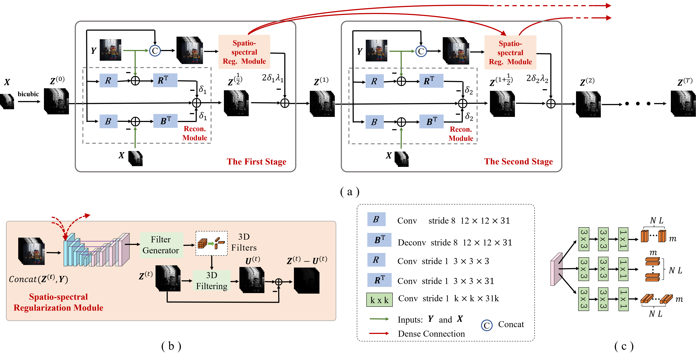

# Deep Hyperspectral Image Fusion Network for HSI Fusion

**This repository contains the PyTorch codes for paper <u>*"Deep Hyperspectral Image Fusion Network with Iterative Spatio-Spectral Regularization"*</u> (*IEEE TRANSACTIONS ON COMPUTATIONAL IMAGING (IEEE TCI), VOL. 6, 2022*) by [Tao Huang](https://github.com/TaoHuang95), [Weisheng Dong](https://see.xidian.edu.cn/faculty/wsdong/), [Xin Li](https://xinli.faculty.wvu.edu/).**  

**[[pdf](https://ieeexplore.ieee.org/document/9718189)] [[Project](https://see.xidian.edu.cn/faculty/wsdong/Projects/TCI2022-DHIF-Net/DHIF-Net.htm)]** 


## Contents

1. [Overview](#Overview)
2. [Architecture](#Architecture)
3. [Usage](#Usage)
6. [Citation](#Citation)
7. [Contact](#Contact)

## Overview
Physical acquisition of high-resolution hyperspectral images (HR-HSI) has remained difficult, despite its potential of resolving material-related ambiguities in vision applications. Deep hyperspectral image fusion, aiming at reconstructing an HR-HSI from a pair of low-resolution hyperspectral image (LRHSI) and high-resolution multispectral image (HR-MSI), has become an appealing computational alternative. Existing fusion methods either rely on hand-crafted image priors or treat fusion as a nonlinear mapping problem, ignoring important physical imaging models. In this paper, we propose a novel regularization strategy to fully exploit the spatio-spectral dependency by a spatially adaptive 3D filter. Moreover, the joint exploitation of spatio-spectral regularization and physical imaging models inspires us to formulate deep hyperspectral image fusion as a differentiable optimization problem. We show how to solve this optimization problem by an end-to-end training of a model-guided unfolding network named DHIF-Net. Unlike existing works of simply concatenating spatial with spectral regularization, our approach aims at an end-to-end optimization of iterative spatio-spectral regularization by multistage network implementations. Our extensive experimental results on both synthetic and real datasets have shown that our DHIF-Net outperforms other competing methods in terms of both objective and subjective visual quality.


## Architecture

<p align="center">

</p>
Fig. 1: Architecture of the proposed network for hyperspectral image fusion. The architecture of (a) the overall network; (b)
the spatio-spectral regularization module; (c) the 3D filter generator.


## Usage

### Download the *DHIF-Net* repository

0. Requirements are Python 3 and PyTorch 1.7.0.

1. Download this repository via git

```
git clone https://github.com/TaoHuang95/DHIF-Net
```


or download the [[zip file](https://github.com/TaoHuang95/DHIF-Net/archive/main.zip)] manually.

### Download the training data

1. [[The Original CAVE Dataset](https://www.cs.columbia.edu/CAVE/databases/multispectral/)]:[[HSI&RGB](https://drive.google.com/drive/folders/1nZnGHQhULspJ9w8Xcbv55wTujJ2lT6tI?usp=sharing)]


### Training 

1. Training simulation model

    1) Put hyperspectral image datasets (Ground truth) and RGB datasets into corrsponding path, i.e., 'CAVE/Data/Train/HSI (RGB)'.

    2) Run **CAVE/Train.py**.


### Testing 

1. Testing on simulation data [[Checkpoint](https://drive.google.com/drive/folders/1l9B1JCUfhfwtmimSpCJlJlnVr16gjdyo?usp=sharing)]

    1) Run **CAVE/Test.py** to reconstruct 12 synthetic datasets. The results will be saved in 'CAVE/Result/' in the MAT File format.  


## Citation


If you find our work useful for your research, please consider citing the following papers :)

```
@ARTICLE{Huang2022Deep,  
  author={Huang, Tao and Dong, Weisheng and Wu, Jinjian and Li, Leida and Li, Xin and Shi, Guangming},  
  journal={IEEE Transactions on Computational Imaging},   
  title={Deep Hyperspectral Image Fusion Network With Iterative Spatio-Spectral Regularization},   
  year={2022},  
  volume={8},  
  number={},  
  pages={201-214},  
  doi={10.1109/TCI.2022.3152700}}
```


## Contact

Tao Huang, Xidian University, Email: thuang_666@stu.xidian.edu.cn, thuang951223@163.com  

Weisheng Dong, Xidian University, Email: wsdong@mail.xidian.edu.cn  

Xin Li, West Virginia University, Email: xin.li@ieee.org
