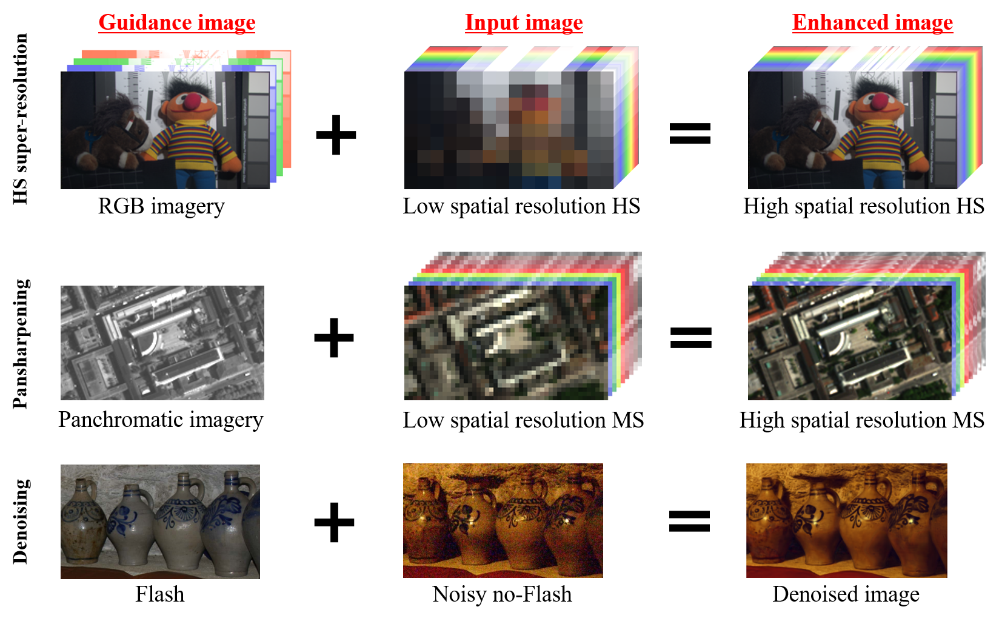

# Guided Deep Decoder
[Arxiv](https://arxiv.org/abs/2007.11766)
### Pytorch implementation of the following paper: 'Guided Deep Decoder: Unsupervised Image Pair Fusion' by Tatsumi Uezato, Danfeng Hong, Naoto Yokoya and Wei He, ECCV 2020.


## Illustration of image pair fusion 
With guided deep decoder, you can solve different image pair fusion problems, for example:



## Abstract
The fusion of input and guidance images that have a tradeoff in their information (e.g., hyperspectral and RGB image fusion or pansharpening) can be interpreted as one general problem. However, previous studies applied a task-specific handcrafted prior and did not address the problems with a unified approach. To address this limitation, in this study, we propose a guided deep decoder network as a general prior. The proposed network is composed of an encoder-decoder network that exploits multi-scale features of a guidance image and a deep decoder network that generates an output image. The two networks are connected by feature refinement units to embed the multi-scale features of the guidance image into the deep decoder network. The proposed network allows the network parameters to be optimized in an unsupervised way without training data. Our results show that the proposed network can achieve state-of-the-art performance in various image fusion problems.

## Citation
If you use this code for your research, please cite our paper:

```
@inproceedings{uezato2020,
  title={Guided Deep Decoder: Unsupervised Image Pair Fusion},
  author={Tatsumi Uezato, Danfeng Hong, Naoto Yokoya, Wei He},
  booktitle={European Conference on Computer Vison (ECCV)},
  year={2020}
}
```
