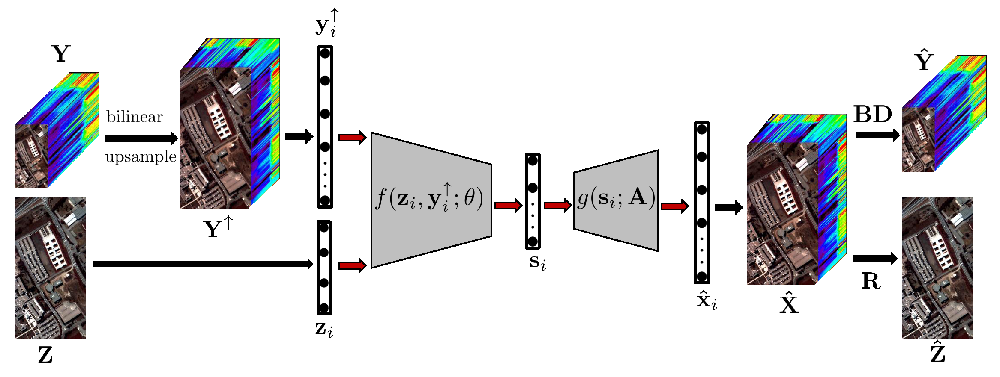
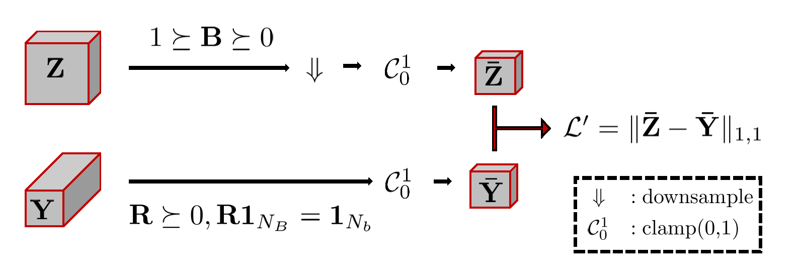

# Model Inspired Autoencoder for Unsupervised Hyperspectral Image Superresolution (MIAE), IEEE TGRS




## files
### `utiles.py`, `blind.py`, `miae.py`

## Requirement
### `python 3.9`, `torch 1.8.1`

## Data
### set class `Datainfo`

## Run
### run `miae.py`

## Class
### `Datainfo`>>`Blind`, `Datainfo`>>`MIAE`

## Bibtex
```
@article{Liu2021ModelIA,
  title={Model Inspired Autoencoder for Unsupervised Hyperspectral Image Super-Resolution},
  author={Jianjun Liu and Zebin Wu and Liang Xiao and Xiao-Jun Wu},
  journal={ArXiv},
  year={2021},
  volume={abs/2110.11591}
}
@ARTICLE{9681709,
  author={Liu, Jianjun and Wu, Zebin and Xiao, Liang and Wu, Xiao-Jun},
  journal={IEEE Transactions on Geoscience and Remote Sensing}, 
  title={Model Inspired Autoencoder for Unsupervised Hyperspectral Image Super-Resolution}, 
  year={2022},
  volume={},
  number={},
  pages={1-1},
  doi={10.1109/TGRS.2022.3143156}
}
```
