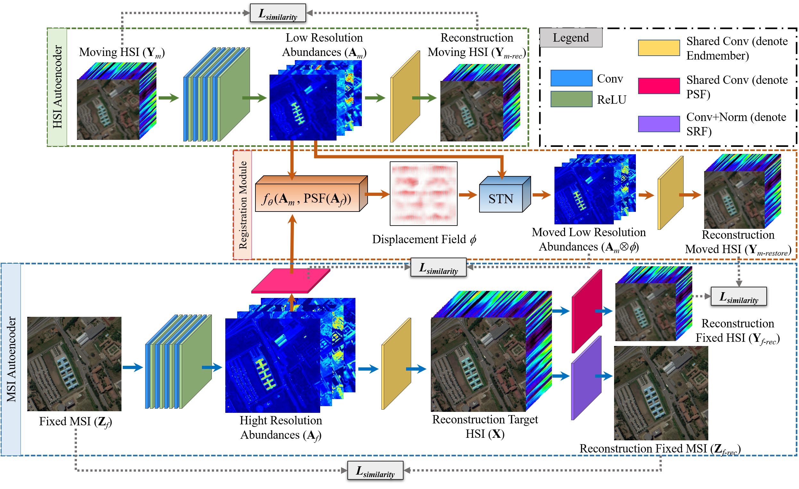

# NonRegSRNet: a Non-rigid Registration a Non-rigid Registration

Code for the paper:[NonRegSRNet: a Non-rigid Registration a Non-rigid Registration](https://ieeexplore.ieee.org/document/9650906/) 

[PDF file](https://github.com/saber-zero/NonRegSRNet/blob/main/NonRegSRNet__a_Non_rigid_Registration_Hyperspectral_Super_Resolution_Network.pdf)

Ke Zheng, [Lianru Gao](https://scholar.google.com/citations?user=f6OnhtcAAAAJ&hl=zh-CN), [Danfeng Hong](https://sites.google.com/view/danfeng-hong), [Bing Zhang](http://english.radi.cas.cn/Education/PhDS/201401/t20140109_115415.html), and [Jocelyn Chanussot](https://scholar.google.com/citations?user=6owK2OQAAAAJ&hl=en)
***
The demo code implements the "NonRegSRNet: a Non-rigid Registration a Non-rigid Registration". 


**Fig.1.** An illustration of the proposed network.
***
### Dependencies
*TODO*

### Training
1. Start visdom first in one terminal
```
visdom --port=8097
```

2. Bring up the page localhost:8097 in your browser

3. Run shell file in another terminal
```
sh bash.sh
```

### Contact
If you encounter any bugs while using this code, please do not hesitate to contact us.
Ke Zheng (:incoming_envelope: zhengkevic@gmail.com, :incoming_envelope: zhengkevic@aircas.ac.cn).

