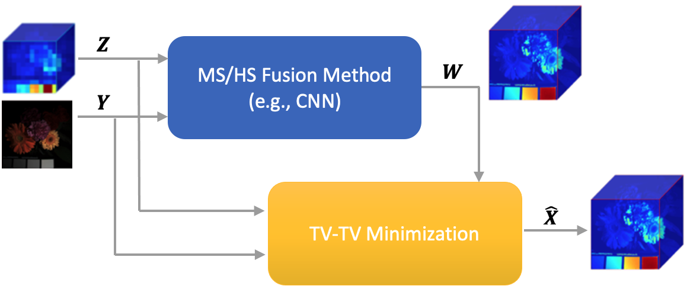
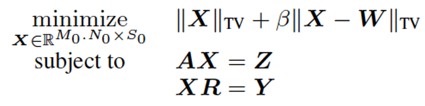
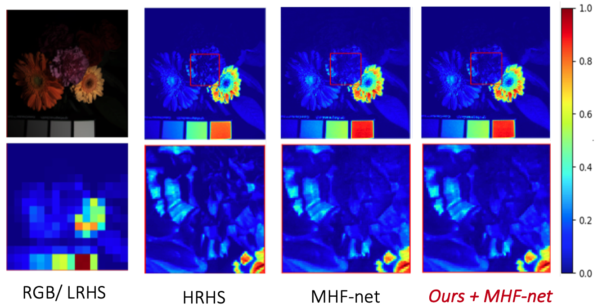

[](https://paperswithcode.com/sota/hyperspectral-image-super-resolution-on?p=enhanced-hyperspectral-image-super-resolution)

## Enhanced Hyperspectral Image Super-Resolution via RGB Fusion and TV-TV Minimization ##

Python 3.x code to reproduce the experiments in

[Enhanced Hyperspectral Image Super-Resolution via RGB Fusion and TV-TV Minimization](https://arxiv.org/abs/2106.07066)

Marija Vella, Bowen Zhang, Wei Chen, João F. C. Mota<br/>
Accepted to ICIP 2021

### Overview ###

Hyperspectral (HS) images contain detailed spectral information that  has proven crucial in applications like remote sensing, surveillance,
and astronomy. However, because of hardware limitations of HS  cameras, the captured images have low spatial resolution. To improve  them, the low-resolution hyperspectral images are fused with conventional high-resolution RGB images via a technique known as  fusion based HS image super-resolution. Currently, the best performance
in this task is achieved by deep learning (DL) methods. Such methods however, cannot guarantee that the input measurements are satisfied in the recovered image, since the learned parameters by the
network are applied to every test image. Conversely, model-based algorithms can typically guarantee such measurement consistency. Inspired by these observations, we propose a framework that integrates learning and model based methods. Experimental results show that  our method produces images of superior spatial and spectral resolution compared to the current leading methods, whether model- or DL-based.

### Proposed Method ###

Diagram of our method: 

<p align="center"></p>

Given a HRMS image, LRHS image and the corresponding super-resolved output W from a MS/HS image fusion HS super-resolution method, the proposed post-processing step guarantees data consistency and improves the quality of W. It achieves that by solving TV-TV minimization:

<p align="center"></p>

where:\
W and X̂ (HRHS) ∈ M<sub>0</sub>.N<sub>0</sub> x S<sub>0</sub> \
Y (HRMS) ∈  M<sub>0</sub>.N<sub>0</sub>  x S \
Z (LRHS) ∈ M.N x S<sub>0</sub> 

 ## Demo ##

This repo runs TV-TV minimization on 3 sample images from the [CAVE](https://www.cs.columbia.edu/CAVE/databases/multispectral/) dataset and uses [MHF](https://openaccess.thecvf.com/content_CVPR_2019/papers/Xie_Multispectral_and_Hyperspectral_Image_Fusion_by_MSHS_Fusion_Net_CVPR_2019_paper.pdf) as the base-method. To run this demo use the following commands

```
git clone https://github.com/marijavella/hs-sr-tvtv
cd hs-sr-tvtv
python main.py
```

### Base methods and datasets ###

This repo only considers 3 sample images. To test more images, place the images in the respective sub-folder of the data folder: HRMS in Y, LRHS in Z and HRHS (from base method) in W. The ground-truth image in sub-folder X is needed to compute the quality metrics and the CSR function (R) is also required. All the images were read from a .mat file. 

In our paper we considered 4 base methods: [MHF](https://openaccess.thecvf.com/content_CVPR_2019/papers/Xie_Multispectral_and_Hyperspectral_Image_Fusion_by_MSHS_Fusion_Net_CVPR_2019_paper.pdf), [uSDN](https://ieeexplore.ieee.org/document/8578364), [CNMF](https://ieeexplore.ieee.org/document/5982386), [NLSTF](https://ieeexplore.ieee.org/document/8099894), and two datasets [CAVE](https://www.cs.columbia.edu/CAVE/databases/multispectral/) and [Harvard](http://vision.seas.harvard.edu/hyperspec/). 
To generate the results from each base method, keep the code/settings provided by the respective authors and place the images in the correct folder as explained above. 

### Results ###

Result obtained on one of the sample images.

<p align="center"></p>

### Dependencies ###

To install the required libraries 

```
pip install -r requirements.txt
```

## Contents ##

There is one main folder:

* ```data```: contains a .mat file with the CSR function and the following subfolders:
  * W - outputs from base method (automatically created once the demo is run)
  * X - HRHS (ground truth)
  * Y - HRMS
  * Z - LRHS 
  
The images provided in this demo were generated according to the specificiations of MHF but these can be replaced with any other fusion based HS image super-resolution method. 
  
The main scripts are:

* ```main.py```: script that runs the solver, saves and shows results of the images in the data folder.

* ```utils.py```: utility functions. 

* ```TVTVHS_Solver.py```: TV-TV solver code.

## Citation ##

```
Vella, M. Zhang, B., Chen, W. & Mota, J. F. C. Enhanced Hyperspectral Image Super-Resolution via RGB Fusion and TV-TV Minimization, ICIP 2021.
```

### Contact ###

The code is provided to be able to replicate our research. If you encounter and errors or would like to give any suggestions kindly contact me directly on mv37@hw.ac.uk.
