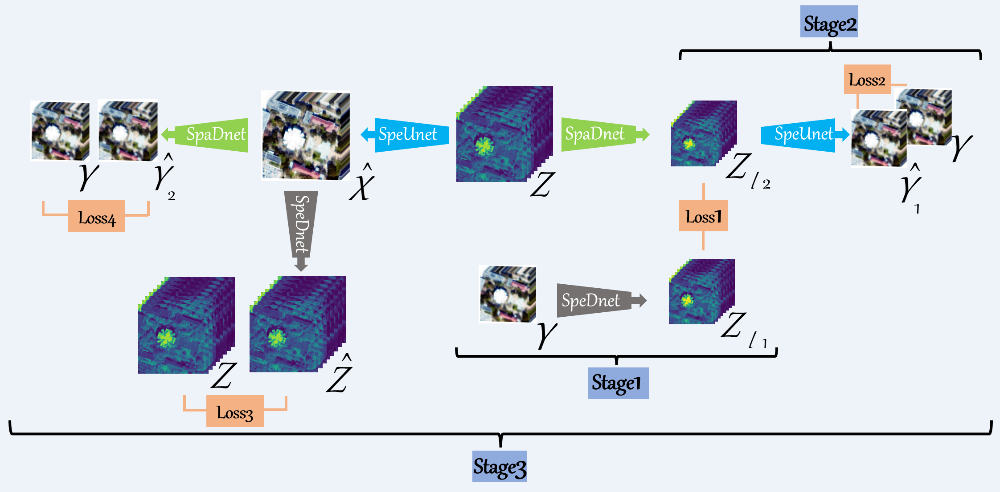
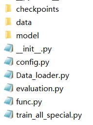

# Deep Unsupervised Blind Hyperspectral and Multispectral Data Fusion

[Jiaxin Li](https://www.researchgate.net/profile/Li-Jiaxin-20), [Ke Zheng](https://www.researchgate.net/profile/Ke-Zheng-9), [Jing Yao](https://scholar.google.com/citationsuser=1SHd5ygAAAAJ&hl=en), [Lianru Gao](https://scholar.google.com/citations?hl=en&user=f6OnhtcAAAAJ), and [Danfeng Hong](https://sites.google.com/view/danfeng-hong)

Our paper is accpeted by IEEE Geoscience and Remote Sensing Letters (GRSL). 

The early access version can be downloaded in my [researchgate](https://www.researchgate.net/publication/358719445_Deep_Unsupervised_Blind_Hyperspectral_and_Multispectral_Data_Fusion).

More information can be found in my [Google Scholar Citations](https://scholar.google.com/citations?user=aSPDpmgAAAAJ&hl=zh-CN).
___________

**Fig.1.** Architecture of the proposed unsupervised degradations adaptive learning network, abbreviated as UDALN, for the task of HSI-MSI fusion.

## Directory structure

**Fig.2.** Directory structure. There are three folders and six .py files in UDALN_GRSL-master.

### checkpoints
This folder is used to store the training results and a folder named `houston18_5_S1=0.001_20000_10000_S2=0.001_30000_20000_S3=6e-05_15000_5000` is given as a example.

- `convolution_hr2msi.pth` is the trained result of SpeDnet, `PSF.pth` is the trained result of SpaDnet, and `spectral_upsample.pth` is the trained result of SpeUnet.

- `opt.txt` is used to store the training configuration.

- `precision.txt` is used to store the training precision.

- `My_Out.mat` is the final reconstructed HHSI.

### data
This folder is used to store the ground true HHSI and corresponding spectral response of multispectral imager. The HSI data used in [2018 IEEE GRSS Data Fusion Contest](https://hyperspectral.ee.uh.edu/?page_id=1075)  and spectral response of WorldView 2 multispectral imager are given as a example here.

### model
This folder consists four .py files, including `spatial_downsample.py(SpaDnet)`, `spectral_downsample.py(SpeDnet)`, `spectral_upsample.py(SpeUnet)`, and `__init__.py`.

### other five .py files
- `config.py`: all the parameters in our methed.

- `Data_loader.py`: generate the simulated low HSI and high MSI.

- `evaluation.py`: compute five metrics, which will be stored in `precision.txt`.

- `func.py`: some functions used in `train_all_special.py`.

- `train_all_special.py`: main.py

## How to run our code
- Requirements: codes of networks were tested using PyTorch 1.9.0 version (CUDA 11.4) in Python 3.8.10 on Windows system. For the required packages, please refer to detailed .py files.

- Parameters: all the parameters need fine-tunning can be found in `config.py`, including the learning rate decay strategy of three training stages.

- Data: put your HSI data and MSI spectral reponse in `./data/data_name` and `./data/spectral_response`, respectively.The HSI data used in [2018 IEEE GRSS Data Fusion Contest](https://hyperspectral.ee.uh.edu/?page_id=1075)  and spectral response of WorldView 2 multispectral imager are given as a example here.

- Run: just simply run `train_all_special.py` after adjust the parameters in `config.py`.

- Results: one folder named `dataname_SF_S1=x1_y1_z1_S2=x2_y2_z2_S3=x3_y3_z3` will be generated once `train_all_special.py` is run and all the results will be stored in the new folder. A folder named `houston18_5_S1=0.001_20000_10000_S2=0.001_30000_20000_S3=6e-05_15000_5000` is given as a example here.

## References

Our work is inspired by the following paper

[1] Zheng, Ke, et al. "Coupled convolutional neural network with adaptive response function learning for unsupervised hyperspectral super-resolution." *IEEE Transactions on Geoscience and Remote Sensing* (2020), DOI: 10.1109/TGRS.2020.3006534.

[2] Yao, Jing, et al. "Cross-attention in coupled unmixing nets for unsupervised hyperspectral super-resolution." In *Proceedings of the European Conference on Computer Vision (ECCV)* (2020), pp. 208-224.

[3] Han, Xiaolin, et al. "Hyperspectral and Multispectral Image Fusion Using Cluster-Based Multi-Branch BP Neural Networks" *Remote Sensing* (2019), DOI: 10.3390/rs11101173.

## Contact

If you encounter any bugs while using this code, please do not hesitate to contact us.

Jiaxin Li (:incoming_envelope: lijiaxin203@mails.ucas.ac.cn)  is currently pursuing the Ph.D. degree in cartography
and geographic information system with the Key Laboratory of Digital Earth Science, Aerospace
Information Research Institute, Chinese Academy of Sciences, Beijing, China.
